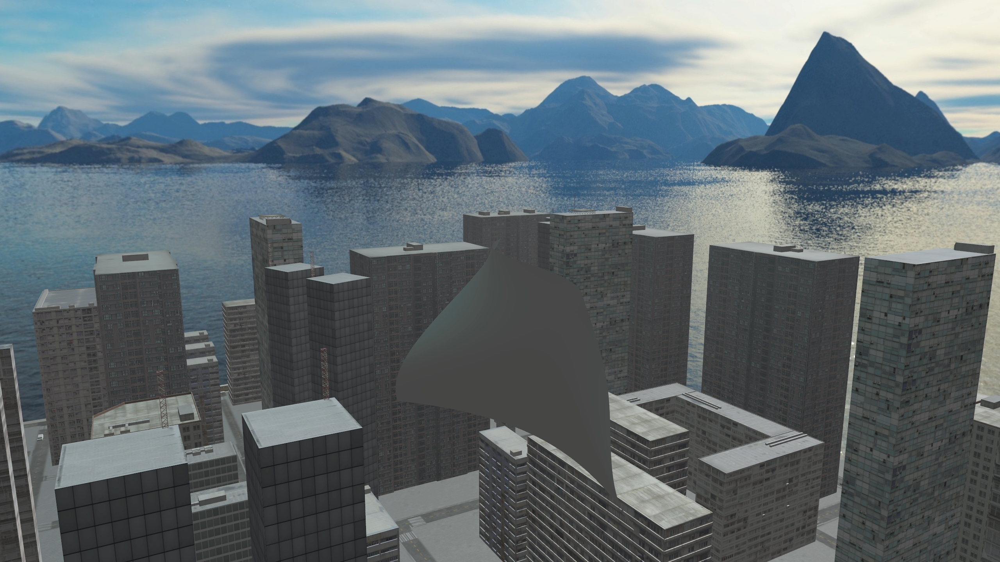
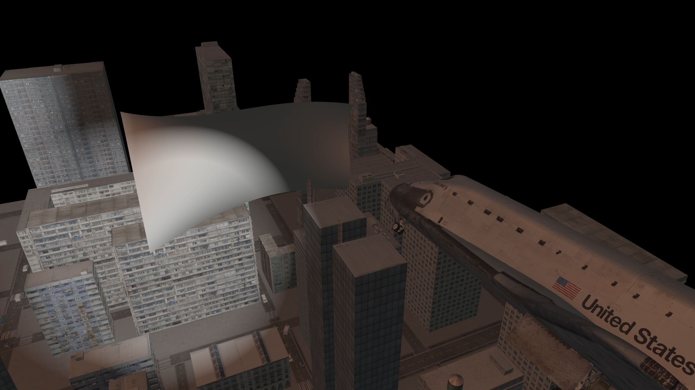
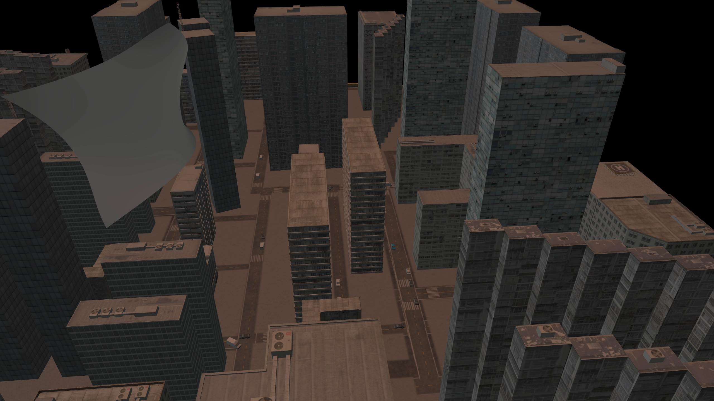
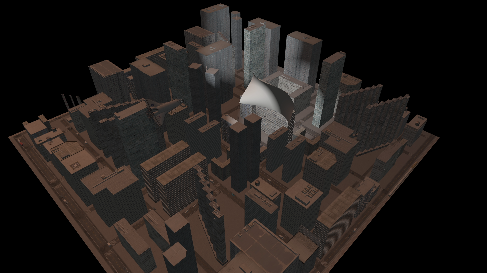

## Apollo

A simple space flight simulation

## Installation on Linux

To install the app on Linux via terminal:

- [ ] Insert the [GLM](http://glm.g-truc.net/)'s directory path instead of the *TODO* word in the [Makefile](Makefile)
- [ ] Execute the following commands with <kbd>pwd</kbd> set to the main directory. Assure that you have [GLFW](http://www.glfw.org/) and [Assimp](http://assimp.org/) installed.

- <kbd>$ make</kbd>

- <kbd>$ ./apollo</kbd>

## Usage

#### Keyboard

- <kbd>1 2 3 4</kbd> Change the view mode

- <kbd>W A S D</kbd> Move around the scene

- <kbd>E</kbd> Toggle the shuttle movement

- <kbd>N</kbd> Switch between 'day' and 'night' modes

#### Mouse

- <kbd>Move</kbd> Rotate the view (the *1*st mode only)

- <kbd>Scroll</kbd> Zoom in/out

## Screenshots

